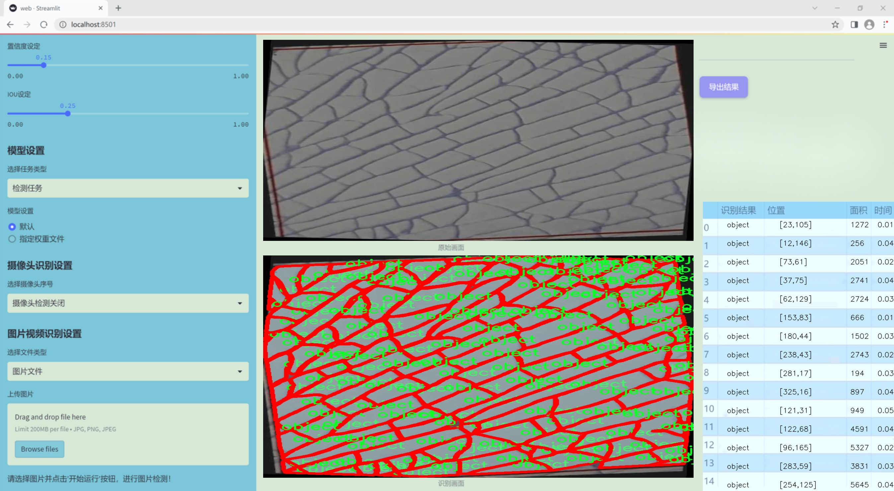
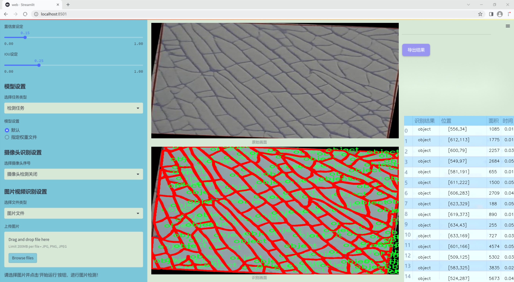
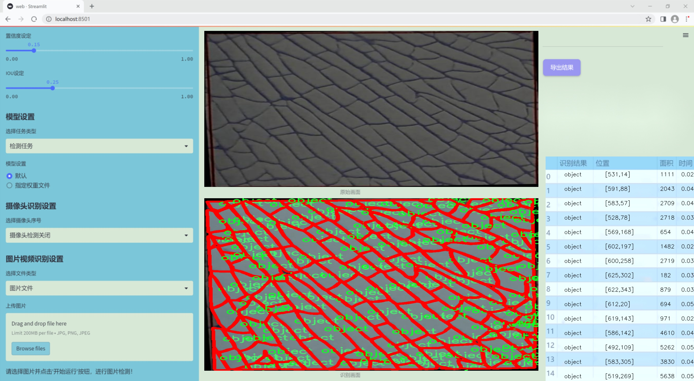
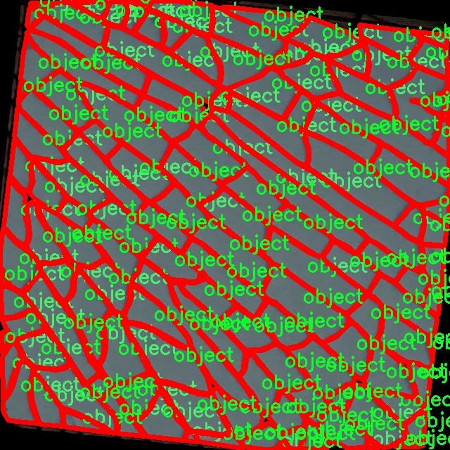
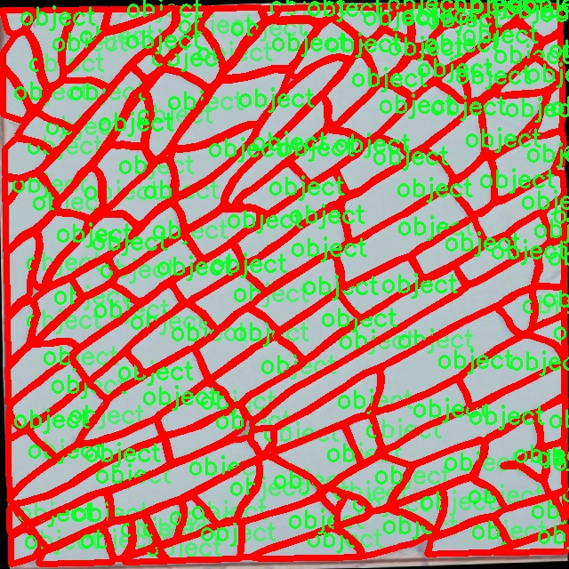
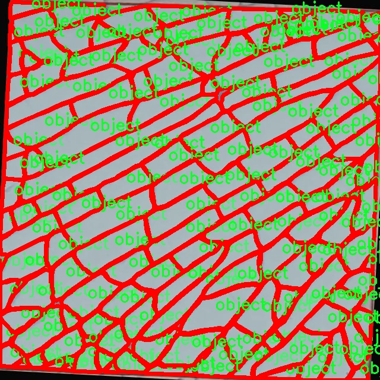
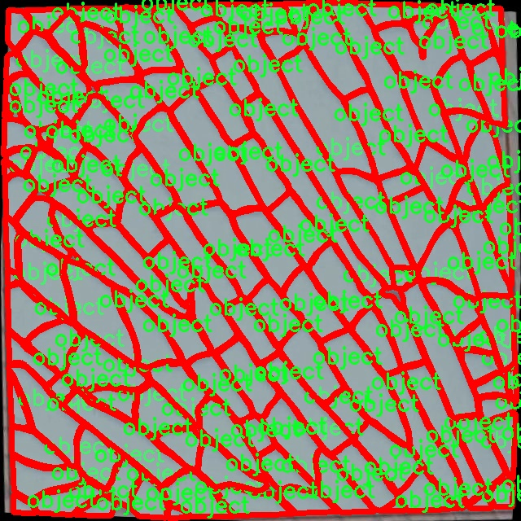
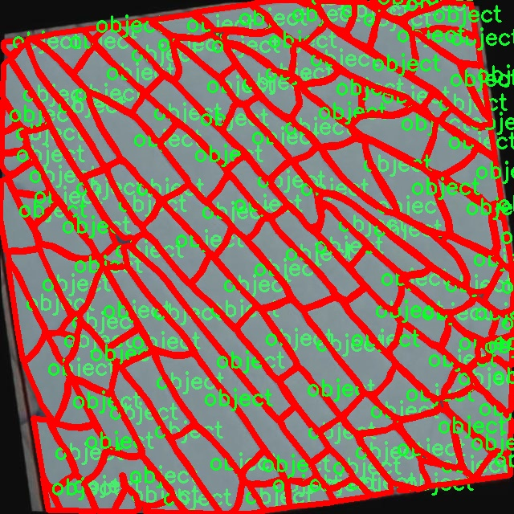

### 1.背景意义

研究背景与意义

随着智能制造和自动化技术的迅速发展，计算机视觉在工业领域的应用日益广泛，尤其是在质量检测和缺陷识别方面。瓷砖作为建筑材料中的重要组成部分，其表面质量直接影响到最终产品的美观和使用性能。因此，开发一种高效的瓷砖图像分割系统，能够自动识别和分割瓷砖表面的缺陷，对于提升生产效率和降低人工成本具有重要意义。

在这一背景下，YOLO（You Only Look Once）系列模型因其优越的实时性和准确性，成为目标检测领域的热门选择。YOLOv11作为该系列的最新版本，具备更强的特征提取能力和更快的推理速度，适合处理复杂的图像分割任务。然而，针对瓷砖图像的特定需求，现有的YOLOv11模型仍需进行改进，以提高其在瓷砖缺陷检测中的表现。

本研究基于一个包含6225张瓷砖图像的数据集，采用YOLOv11模型进行改进，旨在实现对瓷砖表面缺陷的精准分割。该数据集经过精心标注，涵盖了多种可能的缺陷类型，能够为模型的训练提供丰富的样本。通过对图像进行多种增强处理，如随机翻转、旋转和亮度调整，研究将进一步提升模型的鲁棒性和泛化能力。

本项目的实施不仅能够推动瓷砖生产行业的智能化进程，还能为其他类似的工业应用提供借鉴。通过构建高效的图像分割系统，能够实现对瓷砖缺陷的快速识别和分类，进而提高产品质量，降低人工检测的成本，为企业带来显著的经济效益。综上所述，基于改进YOLOv11的瓷砖图像分割系统的研究具有重要的理论价值和实际应用意义。

### 2.视频效果

[2.1 视频效果](https://www.bilibili.com/video/BV1MoU3Y5EvA/)

### 3.图片效果







##### [项目涉及的源码数据来源链接](https://kdocs.cn/l/cszuIiCKVNis)**

注意：本项目提供训练的数据集和训练教程,由于版本持续更新,暂不提供权重文件（best.pt）,请按照6.训练教程进行训练后实现上图演示的效果。

### 4.数据集信息

##### 4.1 本项目数据集类别数＆类别名

nc: 1
names: ['object']


该项目为【图像分割】数据集，请在【训练教程和Web端加载模型教程（第三步）】这一步的时候按照【图像分割】部分的教程来训练

##### 4.2 本项目数据集信息介绍

本项目数据集信息介绍

本项目旨在改进YOLOv11的瓷砖图像分割系统，所使用的数据集名为“Contagem_Caco_Lab”。该数据集专注于瓷砖图像的分析与处理，特别是在瓷砖表面缺陷检测和物体识别方面具有重要的应用价值。数据集中包含的类别数量为1，类别名称为“object”，这表明该数据集主要关注于识别和分割瓷砖表面上的特定物体或缺陷。

在数据集的构建过程中，研究团队收集了大量高质量的瓷砖图像，这些图像涵盖了不同的瓷砖类型、颜色和纹理，以确保模型在多样化的实际应用场景中具有良好的泛化能力。数据集中的图像经过精心标注，确保每个图像中的目标物体都被准确地框定和标识，为后续的训练提供了可靠的基础。

此外，数据集还包含了多种光照条件和拍摄角度下的瓷砖图像，这使得模型能够学习到在不同环境下的物体特征，提高了模型的鲁棒性。通过对这些图像进行数据增强处理，如旋转、缩放和翻转，进一步丰富了训练样本的多样性，增强了模型的学习能力。

本项目的数据集不仅为YOLOv11的训练提供了丰富的样本支持，也为后续的模型评估和优化奠定了坚实的基础。通过对“Contagem_Caco_Lab”数据集的深入分析与应用，期望能够显著提升瓷砖图像分割系统的性能，为瓷砖行业的智能化发展贡献力量。











### 5.全套项目环境部署视频教程（零基础手把手教学）

[5.1 所需软件PyCharm和Anaconda安装教程（第一步）](https://www.bilibili.com/video/BV1BoC1YCEKi/?spm_id_from=333.999.0.0&vd_source=bc9aec86d164b67a7004b996143742dc)


[5.2 安装Python虚拟环境创建和依赖库安装视频教程（第二步）](https://www.bilibili.com/video/BV1ZoC1YCEBw?spm_id_from=333.788.videopod.sections&vd_source=bc9aec86d164b67a7004b996143742dc)

### 6.改进YOLOv11训练教程和Web_UI前端加载模型教程（零基础手把手教学）

[6.1 改进YOLOv11训练教程和Web_UI前端加载模型教程（第三步）](https://www.bilibili.com/video/BV1BoC1YCEhR?spm_id_from=333.788.videopod.sections&vd_source=bc9aec86d164b67a7004b996143742dc)


按照上面的训练视频教程链接加载项目提供的数据集，运行train.py即可开始训练



     Epoch   gpu_mem       box       obj       cls    labels  img_size
     1/200     20.8G   0.01576   0.01955  0.007536        22      1280: 100%|██████████| 849/849 [14:42<00:00,  1.04s/it]
               Class     Images     Labels          P          R     mAP@.5 mAP@.5:.95: 100%|██████████| 213/213 [01:14<00:00,  2.87it/s]
                 all       3395      17314      0.994      0.957      0.0957      0.0843

     Epoch   gpu_mem       box       obj       cls    labels  img_size
     2/200     20.8G   0.01578   0.01923  0.007006        22      1280: 100%|██████████| 849/849 [14:44<00:00,  1.04s/it]
               Class     Images     Labels          P          R     mAP@.5 mAP@.5:.95: 100%|██████████| 213/213 [01:12<00:00,  2.95it/s]
                 all       3395      17314      0.996      0.956      0.0957      0.0845

     Epoch   gpu_mem       box       obj       cls    labels  img_size
     3/200     20.8G   0.01561    0.0191  0.006895        27      1280: 100%|██████████| 849/849 [10:56<00:00,  1.29it/s]
               Class     Images     Labels          P          R     mAP@.5 mAP@.5:.95: 100%|███████   | 187/213 [00:52<00:00,  4.04it/s]
                 all       3395      17314      0.996      0.957      0.0957      0.0845


###### [项目数据集下载链接](https://kdocs.cn/l/cszuIiCKVNis)

### 7.原始YOLOv11算法讲解


###### YOLOv11改进方向

与YOLOv 10相比，YOLOv 11有了巨大的改进，包括但不限于：

  * 增强的模型结构：模型具有改进的模型结构，以获取图像处理并形成预测
  * GPU优化：这是现代ML模型的反映，GPU训练ML模型在速度和准确性上都更好。
  * 速度：YOLOv 11模型现在经过增强和GPU优化以用于训练。通过优化，这些模型比它们的前版本快得多。在速度上达到了25%的延迟减少！
  * 更少的参数：更少的参数允许更快的模型，但v11的准确性不受影响
  * 更具适应性：更多支持的任务YOLOv 11支持多种类型的任务、多种类型的对象和多种类型的图像。

###### YOLOv11功能介绍

Glenn Jocher和他的团队制作了一个令人敬畏的YOLOv 11迭代，并且在图像人工智能的各个方面都提供了YOLO。YOLOv 11有多种型号，包括：

  * 对象检测-在训练时检测图像中的对象
  * 图像分割-超越对象检测，分割出图像中的对象
  * 姿态检测-当用点和线训练时绘制一个人的姿势
  * 定向检测（OBB）：类似于对象检测，但包围盒可以旋转
  * 图像分类-在训练时对图像进行分类

使用Ultralytics Library，这些模型还可以进行优化，以：

  * 跟踪-可以跟踪对象的路径
  * 易于导出-库可以以不同的格式和目的导出
  * 多场景-您可以针对不同的对象和图像训练模型

此外，Ultralytics还推出了YOLOv 11的企业模型，该模型将于10月31日发布。这将与开源的YOLOv
11模型并行，但将拥有更大的专有Ultralytics数据集。YOLOv 11是“建立在过去的成功”的其他版本的之上。

###### YOLOv11模型介绍

YOLOv 11附带了边界框模型（无后缀），实例分割（-seg），姿态估计（-pose），定向边界框（-obb）和分类（-cls）。

这些也有不同的尺寸：纳米（n），小（s），中（m），大（l），超大（x）。


YOLOv11模型

###### YOLOv11与前版本对比

与YOLOv10和YOLOv8相比，YOLOv11在Ultralytics的任何帖子中都没有直接提到。所以我会收集所有的数据来比较它们。感谢Ultralytics：

**检测：**


YOLOv11检测统计


YOLOv10检测统计

其中，Nano的mAPval在v11上为39.5，v10上为38.5；Small为47.0 vs 46.3，Medium为51.5 vs
51.1，Large为53.4 vs 53.2，Extra Large为54.7vs
54.4。现在，这可能看起来像是一种增量增加，但小小数的增加可能会对ML模型产生很大影响。总体而言，YOLOv11以0.3
mAPval的优势追平或击败YOLOv10。

现在，我们必须看看速度。在延迟方面，Nano在v11上为1.55 , v10上为1.84，Small为2.46 v2.49，Medium为4.70
v4.74，Large为6.16 v7.28，Extra Large为11.31
v10.70。延迟越低越好。YOLOv11提供了一个非常低的延迟相比，除了特大做得相当差的前身。

总的来说，Nano模型是令人振奋的，速度更快，性能相当。Extra Large在性能上有很好的提升，但它的延迟非常糟糕。

**分割：**


YOLOV11 分割统计


YOLOV9 分割统计


YOLOV8 分割数据

总体而言，YOLOv 11上的分割模型在大型和超大型模型方面比上一代YOLOv 8和YOLOv 9做得更好。

YOLOv 9 Segmentation没有提供任何关于延迟的统计数据。比较YOLOv 11延迟和YOLOv 8延迟，发现YOLOv 11比YOLOv
8快得多。YOLOv 11将大量GPU集成到他们的模型中，因此期望他们的模型甚至比CPU测试的基准更快！

姿态估计：


YOLOV11姿态估计统计


YOLOV8姿态估计统计

YOLOv 11的mAP 50 -95统计量也逐渐优于先前的YOLOv 8（除大型外）。然而，在速度方面，YOLOv
11姿势可以最大限度地减少延迟。其中一些延迟指标是版本的1/4！通过对这些模型进行GPU训练优化，我可以看到指标比显示的要好得多。

**定向边界框：**


YOLOv11 OBB统计


YOLOv8 OBB统计

OBB统计数据在mAP
50上并不是很好，只有非常小的改进，在某种程度上小于检测中的微小改进。然而，从v8到v11的速度减半，这表明YOLOv11在速度上做了很多努力。

**最后，分类：**


YOLOv 11 CLS统计


YOLOv8 CLS统计

从v8到v11，准确性也有了微小的提高。然而，速度大幅上升，CPU速度更快的型号。


### 8.200+种全套改进YOLOV11创新点原理讲解

#### 8.1 200+种全套改进YOLOV11创新点原理讲解大全

由于篇幅限制，每个创新点的具体原理讲解就不全部展开，具体见下列网址中的改进模块对应项目的技术原理博客网址【Blog】（创新点均为模块化搭建，原理适配YOLOv5~YOLOv11等各种版本）

[改进模块技术原理博客【Blog】网址链接](https://gitee.com/qunmasj/good)


#### 8.2 精选部分改进YOLOV11创新点原理讲解

###### 这里节选部分改进创新点展开原理讲解(完整的改进原理见上图和[改进模块技术原理博客链接](https://gitee.com/qunmasj/good)【如果此小节的图加载失败可以通过CSDN或者Github搜索该博客的标题访问原始博客，原始博客图片显示正常】


### HRNet V2简介
现在设计高低分辨率融合的思路主要有以下四种：


（a）对称结构。如U-Net、Hourglass等，都是先下采样再上采样，上下采样过程对称。

（b）级联金字塔。如refinenet等，高低分辨率融合时经过卷积处理。

（c）简单的baseline，用转职卷积进行上采样。

（d）扩张卷积。如deeplab等，增大感受野，减少下采样次数，可以无需跳层连接直接进行上采样。

（b）（c）都是使用复杂一些的网络进行下采样（如resnet、vgg），再用轻量级的网络进行上采样。

HRNet V1是在（b）的基础上进行改进，从头到尾保持大的分辨率表示。然而HRNet V1仅是用在姿态估计领域的，HRNet V2对它做小小的改进可以使其适用于更广的视觉任务。这一改进仅仅增加了较小的计算开销，但却提升了较大的准确度。

#### 网络结构图：


这个结构图简洁明了就不多介绍了，首先图2的输入是已经经过下采样四倍的feature map，横向的conv block指的是basicblock 或 bottleblock，不同分辨率之间的多交叉线部分是multi-resolution convolution（多分辨率组卷积）。

到此为止HRNet V2和HRNet V1是完全一致的。

区别之处在于这个基网络上加的一个head：


图3介绍的是接在图2最后的head。（a）是HRNet V1的头，很明显他只用了大分辨率的特征图。（b）（c）是HRNet V2的创新点，（b）用与语义分割，（c）用于目标检测。除此之外作者还在实验部分介绍了用于分类的head，如图4所示。


#### 多分辨率block：


一个多分辨率block由多分辨率组卷积（a）和多分辨率卷积（b）组成。（c）是一个正常卷积的展开，（b）的灵感来源于（c）。代码中（a）部分由Bottleneck和BasicBlock组成。

多分辨率卷积和正常卷积的区别：（1）多分辨率卷积中，每个通道的subset的分辨率都不一样。（2）通道之间的连接如果是降分辨率，则用的是3x3的2stride的卷积，如果是升分辨率，用的是双线性最邻近插值上采样。


### 9.系统功能展示

图9.1.系统支持检测结果表格显示

  图9.2.系统支持置信度和IOU阈值手动调节

  图9.3.系统支持自定义加载权重文件best.pt(需要你通过步骤5中训练获得)

  图9.4.系统支持摄像头实时识别

  图9.5.系统支持图片识别

  图9.6.系统支持视频识别

  图9.7.系统支持识别结果文件自动保存

  图9.8.系统支持Excel导出检测结果数据


### 10. YOLOv11核心改进源码讲解

#### 10.1 kaln_conv.py

以下是对代码的核心部分进行分析和详细注释的结果：

```python
from functools import lru_cache
import torch
import torch.nn as nn
from torch.nn.functional import conv3d, conv2d, conv1d

class KALNConvNDLayer(nn.Module):
    def __init__(self, conv_class, norm_class, conv_w_fun, input_dim, output_dim, degree, kernel_size,
                 groups=1, padding=0, stride=1, dilation=1, dropout: float = 0.0, ndim: int = 2):
        super(KALNConvNDLayer, self).__init__()
        
        # 初始化参数
        self.inputdim = input_dim  # 输入维度
        self.outdim = output_dim    # 输出维度
        self.degree = degree         # 多项式的阶数
        self.kernel_size = kernel_size  # 卷积核大小
        self.padding = padding       # 填充
        self.stride = stride         # 步幅
        self.dilation = dilation     # 膨胀
        self.groups = groups         # 分组卷积的组数
        self.base_activation = nn.SiLU()  # 基础激活函数
        self.conv_w_fun = conv_w_fun  # 卷积权重函数
        self.ndim = ndim             # 数据的维度（1D, 2D, 3D）
        self.dropout = None          # Dropout层

        # 初始化Dropout层
        if dropout > 0:
            if ndim == 1:
                self.dropout = nn.Dropout1d(p=dropout)
            elif ndim == 2:
                self.dropout = nn.Dropout2d(p=dropout)
            elif ndim == 3:
                self.dropout = nn.Dropout3d(p=dropout)

        # 验证参数
        if groups <= 0:
            raise ValueError('groups must be a positive integer')
        if input_dim % groups != 0:
            raise ValueError('input_dim must be divisible by groups')
        if output_dim % groups != 0:
            raise ValueError('output_dim must be divisible by groups')

        # 创建基础卷积层和归一化层
        self.base_conv = nn.ModuleList([conv_class(input_dim // groups,
                                                   output_dim // groups,
                                                   kernel_size,
                                                   stride,
                                                   padding,
                                                   dilation,
                                                   groups=1,
                                                   bias=False) for _ in range(groups)])

        self.layer_norm = nn.ModuleList([norm_class(output_dim // groups) for _ in range(groups)])

        # 初始化多项式权重
        poly_shape = (groups, output_dim // groups, (input_dim // groups) * (degree + 1)) + tuple(
            kernel_size for _ in range(ndim))
        self.poly_weights = nn.Parameter(torch.randn(*poly_shape))

        # 使用Kaiming均匀分布初始化卷积层权重
        for conv_layer in self.base_conv:
            nn.init.kaiming_uniform_(conv_layer.weight, nonlinearity='linear')
        nn.init.kaiming_uniform_(self.poly_weights, nonlinearity='linear')

    @lru_cache(maxsize=128)  # 使用缓存避免重复计算勒让德多项式
    def compute_legendre_polynomials(self, x, order):
        # 计算勒让德多项式
        P0 = x.new_ones(x.shape)  # P0 = 1
        if order == 0:
            return P0.unsqueeze(-1)
        P1 = x  # P1 = x
        legendre_polys = [P0, P1]

        # 递归计算高阶多项式
        for n in range(1, order):
            Pn = ((2.0 * n + 1.0) * x * legendre_polys[-1] - n * legendre_polys[-2]) / (n + 1.0)
            legendre_polys.append(Pn)

        return torch.concatenate(legendre_polys, dim=1)

    def forward_kal(self, x, group_index):
        # 前向传播过程
        base_output = self.base_conv[group_index](x)  # 基础卷积输出

        # 将输入归一化到[-1, 1]范围
        x_normalized = 2 * (x - x.min()) / (x.max() - x.min()) - 1 if x.shape[0] > 0 else x

        # 应用Dropout
        if self.dropout is not None:
            x_normalized = self.dropout(x_normalized)

        # 计算勒让德多项式
        legendre_basis = self.compute_legendre_polynomials(x_normalized, self.degree)
        # 使用多项式权重进行卷积
        poly_output = self.conv_w_fun(legendre_basis, self.poly_weights[group_index],
                                      stride=self.stride, dilation=self.dilation,
                                      padding=self.padding, groups=1)

        # 合并基础输出和多项式输出
        x = base_output + poly_output
        # 归一化和激活
        if isinstance(self.layer_norm[group_index], nn.LayerNorm):
            orig_shape = x.shape
            x = self.layer_norm[group_index](x.view(orig_shape[0], -1)).view(orig_shape)
        else:
            x = self.layer_norm[group_index](x)
        x = self.base_activation(x)

        return x

    def forward(self, x):
        # 主前向传播函数
        split_x = torch.split(x, self.inputdim // self.groups, dim=1)  # 按组分割输入
        output = []
        for group_ind, _x in enumerate(split_x):
            y = self.forward_kal(_x.clone(), group_ind)  # 对每个组进行前向传播
            output.append(y.clone())
        y = torch.cat(output, dim=1)  # 合并输出
        return y
```

### 代码分析
1. **KALNConvNDLayer类**: 这是一个自定义的卷积层，支持多维卷积（1D, 2D, 3D），并结合了勒让德多项式的计算。
2. **构造函数**: 初始化输入和输出维度、卷积参数、激活函数等，并创建基础卷积层和归一化层。
3. **compute_legendre_polynomials方法**: 计算勒让德多项式，使用递归关系生成多项式，并使用缓存来提高效率。
4. **forward_kal方法**: 处理单个组的前向传播，包含基础卷积、归一化、激活等步骤。
5. **forward方法**: 处理整个输入的前向传播，按组分割输入并调用`forward_kal`进行处理。

### 注意事项
- 该代码实现了灵活的卷积层设计，允许用户自定义卷积类型、归一化类型和多项式阶数。
- 使用了高效的权重初始化和缓存机制，以提高训练的稳定性和速度。

这个程序文件定义了一个名为 `KALNConvNDLayer` 的神经网络层，旨在实现一种基于Legendre多项式的卷积操作。它使用了PyTorch库，并通过继承的方式创建了1D、2D和3D卷积层的具体实现。首先，`KALNConvNDLayer` 类的构造函数接收多个参数，包括输入和输出维度、卷积核大小、分组数、填充、步幅、扩张率、丢弃率等。构造函数中，首先进行了一些参数的有效性检查，确保分组数为正整数，并且输入和输出维度能够被分组数整除。

接下来，类中创建了基础卷积层和归一化层的模块列表。基础卷积层是通过指定的卷积类（如 `nn.Conv1d`、`nn.Conv2d` 或 `nn.Conv3d`）来实例化的，归一化层则使用指定的归一化类（如 `nn.InstanceNorm1d`、`nn.InstanceNorm2d` 或 `nn.InstanceNorm3d`）。此外，程序还定义了一个多项式权重参数 `poly_weights`，其形状与分组数、输出维度和输入维度相关。

在计算Legendre多项式的过程中，使用了 `lru_cache` 装饰器来缓存计算结果，以避免重复计算。`compute_legendre_polynomials` 方法根据给定的阶数计算Legendre多项式，并返回结果。这个方法首先计算P0和P1，然后通过递归关系计算更高阶的多项式。

`forward_kal` 方法是核心的前向传播逻辑，它接收输入数据和分组索引。首先，它对输入数据应用基础卷积层，然后对输入数据进行归一化，以便于后续的Legendre多项式计算。接着，调用 `compute_legendre_polynomials` 方法计算多项式基，并使用多项式权重进行线性变换。最后，将基础输出和多项式输出相加，并通过归一化层和激活函数进行处理。

`forward` 方法负责处理整个输入数据。它将输入数据按照分组进行切分，然后对每个分组调用 `forward_kal` 方法进行处理，最后将所有分组的输出拼接在一起。

在此基础上，`KALNConv3DLayer`、`KALNConv2DLayer` 和 `KALNConv1DLayer` 类分别继承自 `KALNConvNDLayer`，并通过指定相应的卷积和归一化类来实现三维、二维和一维的卷积层。这些类的构造函数中，默认的归一化层为 `nn.InstanceNorm`，并且提供了灵活的参数设置，以便于用户根据需求进行调整。

整体而言，这个文件实现了一种新颖的卷积层，通过结合Legendre多项式和分组卷积的思想，提供了一种有效的特征提取方式，适用于多种维度的数据处理任务。

#### 10.2 deconv.py

以下是经过简化和注释的核心代码部分：

```python
import math
import torch
from torch import nn
from einops.layers.torch import Rearrange

# 定义一个自定义的卷积层，Conv2d_cd
class Conv2d_cd(nn.Module):
    def __init__(self, in_channels, out_channels, kernel_size=3, stride=1,
                 padding=1, dilation=1, groups=1, bias=False, theta=1.0):
        super(Conv2d_cd, self).__init__()
        # 初始化标准的2D卷积层
        self.conv = nn.Conv2d(in_channels, out_channels, kernel_size=kernel_size, stride=stride, padding=padding, dilation=dilation, groups=groups, bias=bias)
        self.theta = theta  # 用于后续计算的参数

    def get_weight(self):
        # 获取卷积层的权重
        conv_weight = self.conv.weight
        conv_shape = conv_weight.shape  # 获取权重的形状
        # 将权重重排为(c_in, c_out, k1*k2)的形状
        conv_weight = Rearrange('c_in c_out k1 k2 -> c_in c_out (k1 k2)')(conv_weight)
        
        # 创建一个新的权重张量，初始化为0
        conv_weight_cd = torch.zeros(conv_shape[0], conv_shape[1], 3 * 3, device=conv_weight.device, dtype=conv_weight.dtype)
        # 将原始权重赋值到新的权重张量
        conv_weight_cd[:, :, :] = conv_weight[:, :, :]
        # 计算新的权重
        conv_weight_cd[:, :, 4] = conv_weight[:, :, 4] - conv_weight[:, :, :].sum(2)
        # 重排回原来的形状
        conv_weight_cd = Rearrange('c_in c_out (k1 k2) -> c_in c_out k1 k2', k1=conv_shape[2], k2=conv_shape[3])(conv_weight_cd)
        return conv_weight_cd, self.conv.bias  # 返回新的权重和偏置


# 定义一个自定义的卷积层，Conv2d_ad
class Conv2d_ad(nn.Module):
    def __init__(self, in_channels, out_channels, kernel_size=3, stride=1,
                 padding=1, dilation=1, groups=1, bias=False, theta=1.0):
        super(Conv2d_ad, self).__init__()
        self.conv = nn.Conv2d(in_channels, out_channels, kernel_size=kernel_size, stride=stride, padding=padding, dilation=dilation, groups=groups, bias=bias)
        self.theta = theta

    def get_weight(self):
        # 获取卷积层的权重
        conv_weight = self.conv.weight
        conv_shape = conv_weight.shape
        conv_weight = Rearrange('c_in c_out k1 k2 -> c_in c_out (k1 k2)')(conv_weight)
        # 计算新的权重
        conv_weight_ad = conv_weight - self.theta * conv_weight[:, :, [3, 0, 1, 6, 4, 2, 7, 8, 5]]
        conv_weight_ad = Rearrange('c_in c_out (k1 k2) -> c_in c_out k1 k2', k1=conv_shape[2], k2=conv_shape[3])(conv_weight_ad)
        return conv_weight_ad, self.conv.bias


# 定义一个解卷积网络，DEConv
class DEConv(nn.Module):
    def __init__(self, dim):
        super(DEConv, self).__init__()
        # 初始化多个自定义卷积层
        self.conv1_1 = Conv2d_cd(dim, dim, 3, bias=True)
        self.conv1_2 = Conv2d_ad(dim, dim, 3, bias=True)
        self.conv1_3 = nn.Conv2d(dim, dim, 3, padding=1, bias=True)  # 标准卷积层
        self.bn = nn.BatchNorm2d(dim)  # 批归一化层
        self.act = nn.ReLU()  # 激活函数

    def forward(self, x):
        # 前向传播
        w1, b1 = self.conv1_1.get_weight()
        w2, b2 = self.conv1_2.get_weight()
        w3, b3 = self.conv1_3.weight, self.conv1_3.bias

        # 合并权重和偏置
        w = w1 + w2 + w3
        b = b1 + b2 + b3
        # 使用合并后的权重和偏置进行卷积
        res = nn.functional.conv2d(input=x, weight=w, bias=b, stride=1, padding=1, groups=1)
        
        # 应用批归一化和激活函数
        res = self.bn(res)
        return self.act(res)

    def switch_to_deploy(self):
        # 将模型切换到部署模式，合并权重和偏置
        w1, b1 = self.conv1_1.get_weight()
        w2, b2 = self.conv1_2.get_weight()
        w3, b3 = self.conv1_3.weight, self.conv1_3.bias

        self.conv1_3.weight = torch.nn.Parameter(w1 + w2 + w3)
        self.conv1_3.bias = torch.nn.Parameter(b1 + b2 + b3)

        # 删除不再需要的卷积层
        del self.conv1_1
        del self.conv1_2

# 示例代码
if __name__ == '__main__':
    data = torch.randn((1, 128, 64, 64)).cuda()  # 创建随机输入数据
    model = DEConv(128).cuda()  # 初始化模型
    output1 = model(data)  # 前向传播
    model.switch_to_deploy()  # 切换到部署模式
    output2 = model(data)  # 再次前向传播
    print(torch.allclose(output1, output2))  # 检查输出是否相同
```

### 代码说明：
1. **Conv2d_cd 和 Conv2d_ad**：这两个类定义了自定义的卷积层，分别实现了不同的权重计算方式。`get_weight` 方法用于获取处理后的权重和偏置。
2. **DEConv**：这是一个解卷积网络，包含多个卷积层，并在前向传播中合并这些层的权重和偏置。`switch_to_deploy` 方法用于在部署时合并权重和偏置，以提高推理效率。
3. **示例代码**：在 `__main__` 部分，创建了一个随机输入并测试了模型的前向传播，确保在切换到部署模式后输出仍然一致。

这个程序文件 `deconv.py` 定义了一些自定义的卷积层类，主要用于深度学习中的卷积操作。文件中使用了 PyTorch 框架，并引入了一些额外的模块和工具。以下是对代码的详细说明。

首先，程序导入了必要的库，包括 `math`、`torch` 和 `torch.nn`，以及 `einops` 库中的 `Rearrange` 类。`Conv` 类来自于上级模块，`fuse_conv_and_bn` 是用于融合卷积层和批归一化层的工具。

接下来，定义了多个卷积层类，每个类都继承自 `nn.Module`。这些类的主要功能是实现不同类型的卷积操作，具体如下：

1. **Conv2d_cd**：这是一个自定义的卷积层，包含一个标准的 2D 卷积层，并提供了一个 `get_weight` 方法来获取卷积权重。该方法将权重重排列，并进行一些处理以生成新的权重。

2. **Conv2d_ad**：类似于 `Conv2d_cd`，但在 `get_weight` 方法中对权重进行了不同的处理，使用了一个 `theta` 参数来调整权重。

3. **Conv2d_rd**：这个类实现了一个卷积层，并在 `forward` 方法中根据 `theta` 的值决定是否使用标准卷积或是使用调整后的权重进行卷积操作。

4. **Conv2d_hd** 和 **Conv2d_vd**：这两个类分别实现了一维卷积层的权重获取，采用了不同的权重调整方式。

最后，定义了一个名为 `DEConv` 的类，它包含了多个自定义卷积层的实例，并在 `forward` 方法中将这些卷积层的输出进行加和，最终通过一个标准的卷积层输出结果。`switch_to_deploy` 方法用于在推理阶段将多个卷积层的权重合并为一个卷积层，以提高计算效率。

在文件的最后部分，包含了一个测试代码块，用于验证模型的输出。在这个测试中，创建了一个随机输入数据，实例化了 `DEConv` 模型并将数据传入模型中，计算输出。然后调用 `switch_to_deploy` 方法，合并卷积层后再次计算输出，最后通过 `torch.allclose` 函数检查两个输出是否相等。

总体而言，这个文件实现了一些复杂的卷积操作，旨在通过自定义的卷积层和权重调整机制来提高模型的表现和效率。

#### 10.3 test_selective_scan.py

以下是保留的核心代码部分，并附上详细的中文注释：

```python
import torch
import torch.nn.functional as F

def build_selective_scan_fn(selective_scan_cuda: object = None, mode="mamba_ssm"):
    """
    构建选择性扫描函数的工厂函数，根据给定的CUDA实现和模式返回相应的选择性扫描函数。
    """
    class SelectiveScanFn(torch.autograd.Function):
        @staticmethod
        def forward(ctx, u, delta, A, B, C, D=None, z=None, delta_bias=None, delta_softplus=False, return_last_state=False):
            """
            前向传播函数，执行选择性扫描操作。
            参数：
            - u: 输入张量
            - delta: 增量张量
            - A, B, C: 权重张量
            - D: 可选的偏置张量
            - z: 可选的门控张量
            - delta_bias: 可选的增量偏置
            - delta_softplus: 是否应用softplus激活
            - return_last_state: 是否返回最后的状态
            """
            # 确保输入张量是连续的
            if u.stride(-1) != 1:
                u = u.contiguous()
            if delta.stride(-1) != 1:
                delta = delta.contiguous()
            if D is not None:
                D = D.contiguous()
            if B.stride(-1) != 1:
                B = B.contiguous()
            if C.stride(-1) != 1:
                C = C.contiguous()
            if z is not None and z.stride(-1) != 1:
                z = z.contiguous()

            # 进行选择性扫描的CUDA调用
            out, x, *rest = selective_scan_cuda.fwd(u, delta, A, B, C, D, z, delta_bias, delta_softplus)

            # 保存必要的上下文信息以供反向传播使用
            ctx.save_for_backward(u, delta, A, B, C, D, delta_bias, x)

            # 计算最后的状态
            last_state = x[:, :, -1, 1::2]  # (batch, dim, dstate)
            return out if not return_last_state else (out, last_state)

        @staticmethod
        def backward(ctx, dout):
            """
            反向传播函数，计算梯度。
            参数：
            - dout: 上游梯度
            """
            # 从上下文中恢复保存的张量
            u, delta, A, B, C, D, delta_bias, x = ctx.saved_tensors

            # 调用CUDA后向传播
            du, ddelta, dA, dB, dC, dD, ddelta_bias, *rest = selective_scan_cuda.bwd(u, delta, A, B, C, D, delta_bias, dout, x)

            return du, ddelta, dA, dB, dC, dD, ddelta_bias, None

    def selective_scan_fn(u, delta, A, B, C, D=None, z=None, delta_bias=None, delta_softplus=False, return_last_state=False):
        """
        选择性扫描函数的接口，调用选择性扫描的前向和反向传播。
        """
        return SelectiveScanFn.apply(u, delta, A, B, C, D, z, delta_bias, delta_softplus, return_last_state)

    return selective_scan_fn

# 选择性扫描函数的构建
selective_scan_fn = build_selective_scan_fn(selective_scan_cuda=None, mode="mamba_ssm")

# 示例输入
u = torch.randn(2, 768, 64, requires_grad=True)  # (batch, dim, seqlen)
delta = torch.randn(2, 768, 64, requires_grad=True)
A = torch.randn(768, 1, requires_grad=True)
B = torch.randn(2, 1, 768, 64, requires_grad=True)
C = torch.randn(2, 768, 64, requires_grad=True)

# 调用选择性扫描函数
output = selective_scan_fn(u, delta, A, B, C)
print(output)
```

### 代码说明：
1. **导入必要的库**：导入了PyTorch和其功能模块。
2. **构建选择性扫描函数**：`build_selective_scan_fn` 函数创建一个选择性扫描的自定义函数类，使用 PyTorch 的自动求导功能。
3. **前向传播**：`forward` 方法实现了选择性扫描的核心逻辑，接收输入并计算输出，同时保存用于反向传播的张量。
4. **反向传播**：`backward` 方法实现了梯度计算，使用 CUDA 的后向传播函数。
5. **选择性扫描函数接口**：`selective_scan_fn` 是对外的接口，调用前向和反向传播方法。
6. **示例输入**：提供了一个简单的示例，展示如何使用选择性扫描函数。

该代码的核心部分是前向和反向传播的实现，确保输入的连续性，并调用相应的 CUDA 函数进行计算。

这个程序文件 `test_selective_scan.py` 是一个用于测试选择性扫描（Selective Scan）操作的实现，主要基于 PyTorch 框架。程序中包含了选择性扫描的前向和反向传播的实现，以及相应的测试函数。

首先，程序导入了必要的库，包括 `torch` 和 `pytest`，并定义了一个函数 `build_selective_scan_fn`，该函数用于构建选择性扫描的前向和反向传播函数。这个函数内部定义了一个名为 `SelectiveScanFn` 的类，继承自 `torch.autograd.Function`，并实现了静态方法 `forward` 和 `backward`。

在 `forward` 方法中，首先对输入的张量进行了一系列的连续性检查和维度调整，确保输入的格式符合要求。接着，根据不同的模式（如 `mamba_ssm`、`ssoflex` 等），调用相应的 CUDA 后端实现进行前向计算。计算结果会根据 `return_last_state` 参数决定是否返回最后的状态。

`backward` 方法实现了反向传播的逻辑，主要是根据前向计算中保存的张量计算梯度，并返回相应的梯度信息。

接下来，程序定义了两个参考实现 `selective_scan_ref` 和 `selective_scan_ref_v2`，这些实现用于验证 CUDA 实现的正确性。它们接受与 `selective_scan_fn` 相同的参数，并执行相应的计算。

程序的核心部分是 `test_selective_scan` 函数，这是一个使用 `pytest` 框架的测试函数。它使用多种参数组合来测试选择性扫描的实现，包括输入张量的形状、数据类型、是否使用偏置等。测试过程中，会生成随机的输入数据，并调用选择性扫描的前向和反向函数进行计算，最后通过比较输出和梯度来验证实现的正确性。

在文件的最后，程序通过设置不同的模式来选择合适的 CUDA 实现，并打印出当前使用的模式。整个程序的设计旨在确保选择性扫描操作的实现能够在不同的配置下正常工作，并通过测试验证其准确性和性能。

#### 10.4 shiftwise_conv.py

以下是代码中最核心的部分，并附上详细的中文注释：

```python
import math
import torch
import torch.nn as nn
import torch.nn.functional as F

def get_conv2d(in_channels, out_channels, kernel_size, stride, padding, dilation, groups, bias):
    """
    创建一个二维卷积层
    :param in_channels: 输入通道数
    :param out_channels: 输出通道数
    :param kernel_size: 卷积核大小
    :param stride: 步幅
    :param padding: 填充
    :param dilation: 膨胀率
    :param groups: 分组卷积的组数
    :param bias: 是否使用偏置
    :return: nn.Conv2d对象
    """
    return nn.Conv2d(
        in_channels, out_channels, kernel_size, stride, padding, dilation, groups, bias
    )

class Mask(nn.Module):
    """
    定义一个Mask类，用于生成可学习的权重掩码
    """
    def __init__(self, size):
        super().__init__()
        # 初始化权重参数，范围在-1到1之间
        self.weight = torch.nn.Parameter(data=torch.Tensor(*size), requires_grad=True)
        self.weight.data.uniform_(-1, 1)

    def forward(self, x):
        # 通过sigmoid函数将权重转换为0到1之间的值
        w = torch.sigmoid(self.weight)
        # 将输入x与权重w相乘，得到掩码后的输出
        masked_wt = w.mul(x)
        return masked_wt

class ReparamLargeKernelConv(nn.Module):
    """
    重参数化大卷积核的卷积层
    """
    def __init__(self, in_channels, out_channels, kernel_size, small_kernel=5, stride=1, groups=1, small_kernel_merged=False, Decom=True, bn=True):
        super(ReparamLargeKernelConv, self).__init__()
        self.kernel_size = kernel_size
        self.small_kernel = small_kernel
        self.Decom = Decom
        padding = kernel_size // 2  # 计算填充大小

        # 如果使用小卷积合并的方式
        if small_kernel_merged:
            self.lkb_reparam = get_conv2d(
                in_channels=in_channels,
                out_channels=out_channels,
                kernel_size=kernel_size,
                stride=stride,
                padding=padding,
                dilation=1,
                groups=groups,
                bias=True,
            )
        else:
            # 根据是否分解选择不同的卷积结构
            if self.Decom:
                self.LoRA = conv_bn(
                    in_channels=in_channels,
                    out_channels=out_channels,
                    kernel_size=(kernel_size, small_kernel),
                    stride=stride,
                    padding=padding,
                    dilation=1,
                    groups=groups,
                    bn=bn
                )
            else:
                self.lkb_origin = conv_bn(
                    in_channels=in_channels,
                    out_channels=out_channels,
                    kernel_size=kernel_size,
                    stride=stride,
                    padding=padding,
                    dilation=1,
                    groups=groups,
                    bn=bn,
                )

            # 如果小卷积核小于大卷积核，则创建小卷积层
            if (small_kernel is not None) and small_kernel < kernel_size:
                self.small_conv = conv_bn(
                    in_channels=in_channels,
                    out_channels=out_channels,
                    kernel_size=small_kernel,
                    stride=stride,
                    padding=small_kernel // 2,
                    groups=groups,
                    dilation=1,
                    bn=bn,
                )
        
        self.bn = get_bn(out_channels)  # 批归一化层
        self.act = nn.SiLU()  # 激活函数

    def forward(self, inputs):
        # 前向传播
        if hasattr(self, "lkb_reparam"):
            out = self.lkb_reparam(inputs)  # 使用重参数化卷积
        elif self.Decom:
            out = self.LoRA(inputs)  # 使用LoRA卷积
            if hasattr(self, "small_conv"):
                out += self.small_conv(inputs)  # 加上小卷积的输出
        else:
            out = self.lkb_origin(inputs)  # 使用原始卷积
            if hasattr(self, "small_conv"):
                out += self.small_conv(inputs)  # 加上小卷积的输出
        return self.act(self.bn(out))  # 返回经过激活和归一化的输出

    def get_equivalent_kernel_bias(self):
        # 获取等效的卷积核和偏置
        eq_k, eq_b = fuse_bn(self.lkb_origin.conv, self.lkb_origin.bn)
        if hasattr(self, "small_conv"):
            small_k, small_b = fuse_bn(self.small_conv.conv, self.small_conv.bn)
            eq_b += small_b  # 合并偏置
            eq_k += nn.functional.pad(small_k, [(self.kernel_size - self.small_kernel) // 2] * 4)  # 填充小卷积核
        return eq_k, eq_b

    def switch_to_deploy(self):
        # 切换到部署模式
        if hasattr(self, 'lkb_origin'):
            eq_k, eq_b = self.get_equivalent_kernel_bias()  # 获取等效卷积核和偏置
            self.lkb_reparam = get_conv2d(
                in_channels=self.lkb_origin.conv.in_channels,
                out_channels=self.lkb_origin.conv.out_channels,
                kernel_size=self.lkb_origin.conv.kernel_size,
                stride=self.lkb_origin.conv.stride,
                padding=self.lkb_origin.conv.padding,
                dilation=self.lkb_origin.conv.dilation,
                groups=self.lkb_origin.conv.groups,
                bias=True,
            )
            self.lkb_reparam.weight.data = eq_k  # 设置权重
            self.lkb_reparam.bias.data = eq_b  # 设置偏置
            self.__delattr__("lkb_origin")  # 删除原始卷积属性
            if hasattr(self, "small_conv"):
                self.__delattr__("small_conv")  # 删除小卷积属性
```

### 代码核心部分解释：
1. **`get_conv2d`**: 创建一个标准的二维卷积层。
2. **`Mask`**: 定义了一个掩码层，用于生成可学习的权重。
3. **`ReparamLargeKernelConv`**: 这是重参数化大卷积核的核心类，包含了不同卷积结构的选择和前向传播逻辑。
4. **`forward`**: 实现了前向传播逻辑，支持不同的卷积结构。
5. **`get_equivalent_kernel_bias`**: 计算等效的卷积核和偏置，用于模型部署时的优化。
6. **`switch_to_deploy`**: 切换到部署模式，准备将模型参数转化为可直接使用的形式。

这个程序文件 `shiftwise_conv.py` 实现了一个用于卷积神经网络的模块，主要关注于处理大卷积核和小卷积核的组合。文件中定义了多个类和函数，以便于构建具有不同特性的卷积层。

首先，文件导入了必要的库，包括 `torch` 和 `torch.nn`，这些库是 PyTorch 框架的核心部分，用于构建和训练神经网络。`__all__` 变量定义了该模块公开的接口，只有 `ReparamLargeKernelConv` 类会被导出。

`get_conv2d` 函数用于创建一个标准的二维卷积层，支持多种参数设置，包括输入输出通道数、卷积核大小、步幅、填充、扩张、分组和偏置。函数中处理了填充的计算，以确保卷积操作不会改变特征图的大小。

`get_bn` 函数用于创建一个批归一化层，帮助加速训练并提高模型的稳定性。

`Mask` 类定义了一个掩码模块，它使用一个可学习的权重参数来对输入进行加权。通过对权重应用 Sigmoid 函数，掩码的值被限制在 0 到 1 之间，从而对输入进行加权。

`conv_bn_ori` 函数构建一个包含卷积层和可选的批归一化层的序列。它会根据输入参数创建卷积层，并在需要时添加批归一化层。

`LoRAConvsByWeight` 类实现了一种特殊的卷积层，旨在通过权重而非索引来打乱通道。它接受大卷积核和小卷积核的大小，并在前向传播中将输入通过多个卷积操作进行处理，最终将结果相加。

`ReparamLargeKernelConv` 类是文件的核心部分，它实现了一个可重参数化的大卷积核卷积层。根据输入参数，它可以选择直接使用一个大卷积核，或者将其分解为小卷积核和大卷积核的组合。该类在初始化时会设置相应的卷积层和批归一化层，并在前向传播中计算输出。

`fuse_bn` 函数用于将卷积层和批归一化层融合为一个单一的卷积层，以提高推理速度。

整体来看，这个文件提供了一种灵活的方式来处理不同大小的卷积核，允许在训练和推理阶段之间进行高效的切换。通过使用可学习的掩码和分解卷积的策略，模型能够在保持性能的同时减少计算量。

### 11.完整训练+Web前端界面+200+种全套创新点源码、数据集获取


# [下载链接：https://mbd.pub/o/bread/Z5WclZht](https://mbd.pub/o/bread/Z5WclZht)